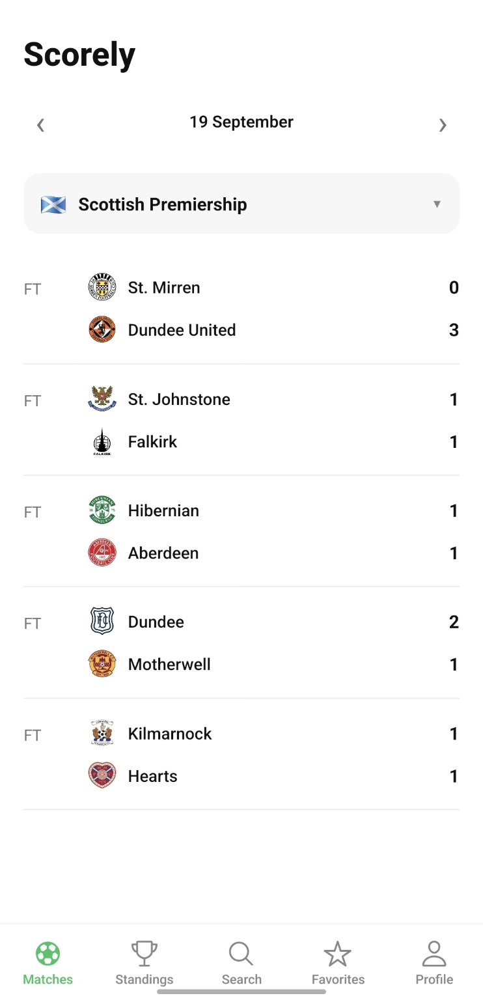
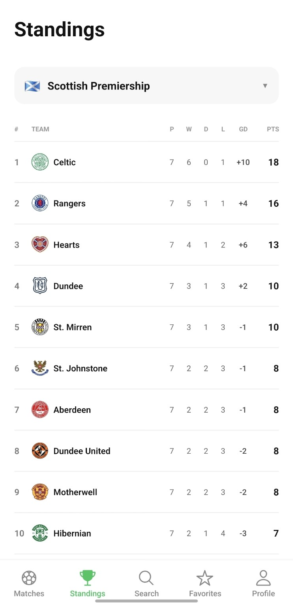
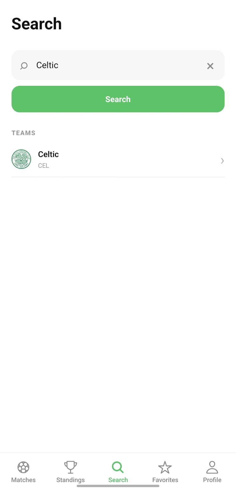
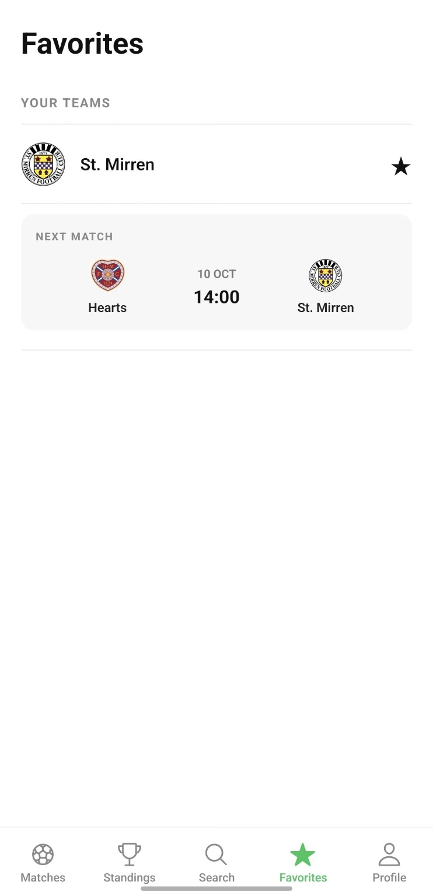
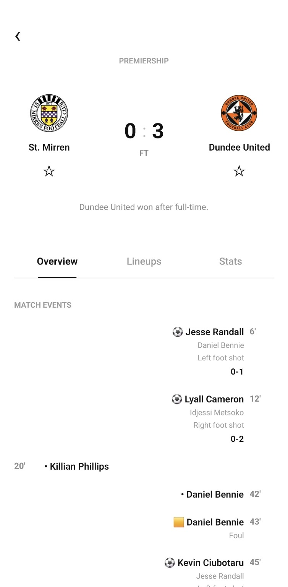
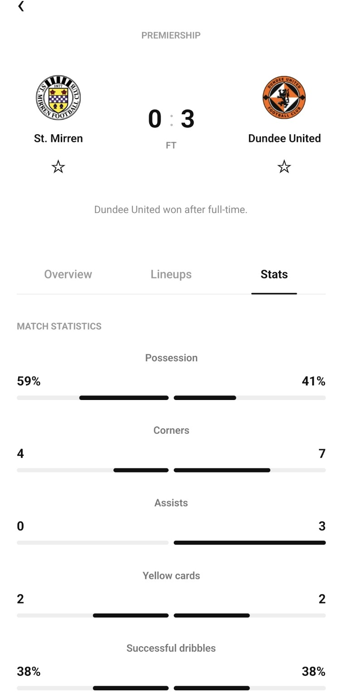
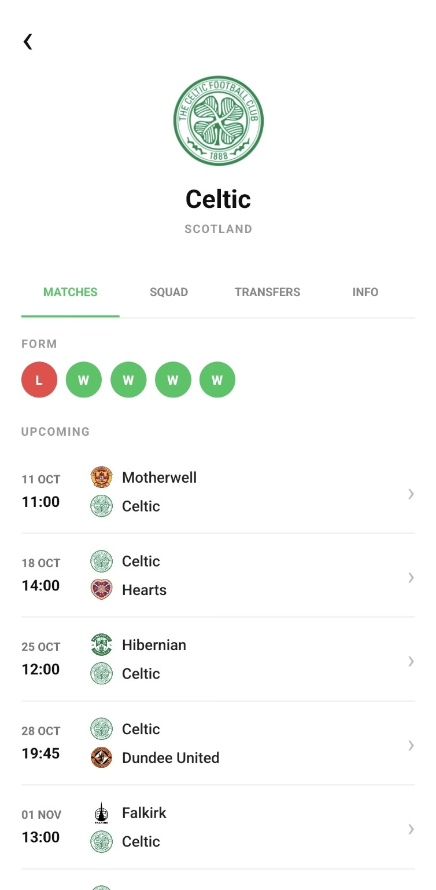
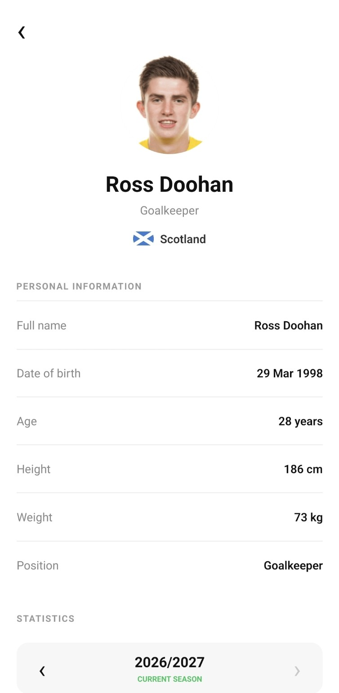

# ⚽ Scorely


**Scorely** is a full-stack football scores and statistics mobile application built with **React Native, Expo and TypeScript**.

It provides football match data, league standings, detailed match statistics, lineups, team and player profiles, transfers, search functionality and persistent favorites through a custom **Node.js REST API**.

---

## 📱 About the Project

Scorely was developed as a modern football mobile application inspired by platforms such as Flashscore and Sofascore.

The goal of the project is to provide a clean and simple mobile experience for exploring football data while also demonstrating a complete full-stack architecture.

The mobile application communicates with a custom REST API built with **Node.js and Express**.

The backend retrieves football data from the **Sportmonks Football API**, transforms the responses and exposes only the data required by the mobile client.

This architecture also keeps external API credentials securely on the server instead of exposing them inside the mobile application.

---

## ✨ Features

### ⚽ Matches

- Browse football matches by date
- Switch between supported leagues
- View match status and scores
- Open detailed match information
- View recent team form
- Navigate directly to team profiles

### 📊 Match Details

- Match overview
- Match events
- Goals and important incidents
- Starting lineups
- Match statistics
- Ball possession
- Corners
- Goals
- Cards and other available statistics

### 🏆 Standings

- League table
- Position
- Matches played
- Wins
- Draws
- Losses
- Goal difference
- Points
- Direct navigation to team profiles

### 🏟️ Team Profiles

- Club information
- Stadium information
- Upcoming matches
- Previous results
- Recent form
- Squad
- Player navigation
- Incoming transfers
- Outgoing transfers
- Transfer history

### 👤 Player Profiles

- Player information
- Position
- Nationality
- Date of birth
- Height and weight
- Current club
- Career history
- Transfer history
- Seasonal statistics
- Appearances
- Starts
- Minutes played
- Goals
- Assists
- Cards

### 🔎 Search

Search directly for:

- Teams
- Players

Search results provide direct navigation to the corresponding team or player profile.

### ⭐ Favorites

- Add teams to favorites
- Remove teams from favorites
- Store favorites locally using AsyncStorage
- View upcoming matches for favorite teams
- Persistent favorites between application sessions

### 🌍 Multiple Leagues

Scorely currently supports:

- Scottish Premiership
- Danish Superliga

The architecture allows additional leagues to be integrated in the future depending on API availability.

---

## 🛠️ Tech Stack

### Mobile Application

- React Native
- Expo
- Expo Router
- TypeScript
- AsyncStorage

### Backend

- Node.js
- Express
- Axios
- REST API

### Football Data

- Sportmonks Football API

### Testing & QA

- Jest
- Supertest
- API mocking
- Regression testing
- GitHub Actions

### Deployment

- Expo EAS Build
- Render
- GitHub

---

## 🏗️ Architecture

```text
┌──────────────────────────┐
│      Scorely Mobile      │
│                          │
│ React Native + Expo      │
│ TypeScript               │
└────────────┬─────────────┘
             │
             │ HTTPS / REST
             ▼
┌──────────────────────────┐
│       Scorely API        │
│                          │
│ Node.js + Express        │
│ Hosted on Render         │
└────────────┬─────────────┘
             │
             │ HTTPS
             ▼
┌──────────────────────────┐
│   Sportmonks Football    │
│           API            │
└──────────────────────────┘
```

The Sportmonks API token is stored securely as an environment variable on the backend and is never exposed inside the mobile application.

---

## 📂 Project Structure

```text
src/
├── app/
│   ├── (tabs)/
│   │   ├── index.tsx
│   │   ├── standings.tsx
│   │   ├── search.tsx
│   │   ├── favorites.tsx
│   │   └── profile.tsx
│   │
│   ├── match/
│   │   └── [id].tsx
│   │
│   ├── team/
│   │   └── [id].tsx
│   │
│   ├── player/
│   │   └── [id].tsx
│   │
│   └── _layout.tsx
│
├── config/
│   └── api.ts
│
├── context/
│   ├── LeagueContext.tsx
│   └── ThemeContext.tsx
│
├── theme/
│
└── utils/
    ├── favorites.ts
    └── theme.ts
```

---

## 🌐 Backend

Scorely uses a separate **Node.js + Express** backend.

The backend acts as an intermediary between the mobile application and the Sportmonks Football API.

### Responsibilities

- Protect external API credentials
- Fetch football data
- Transform external API responses
- Provide a simplified REST API for the mobile client
- Handle external API errors
- Centralize football data logic

### Backend Repository

[Scorely Server](https://github.com/lucianbutuc16/scorely-server)

### Live API

[https://scorely-server.onrender.com](https://scorely-server.onrender.com)

---

## 🔐 Security

Sensitive credentials such as the Sportmonks API token are never stored inside the mobile application or committed to GitHub.

The backend uses environment variables:

```text
SPORTMONKS_API_TOKEN
```

The mobile application communicates only with the deployed Scorely REST API.

---

## 📱 Android Build

Scorely has been successfully built as a standalone Android application using **Expo EAS Build**.

The installed application runs independently without:

- Expo Go
- A local Node.js backend
- A development computer
- A local network connection to the backend

The Android application communicates directly with the cloud-hosted Scorely API.

---

## 🖼️ Screenshots

<p align="center">
  
  
  
  
</p>

<p align="center">
  
  
  
  
</p>

---

## 🧪 Testing & QA

Scorely includes automated backend API testing using **Jest** and **Supertest**.

The current test suite contains **10 automated tests**.

### Test Coverage

The test suite currently covers:

- API health checks
- Input validation
- Match response transformation
- Match score transformation
- Scheduled matches without scores
- External API error handling
- League validation
- Correct season selection
- Team and player search
- Placeholder team filtering
- Match statistics transformation
- Regression testing for previously fixed bugs

### Mocking External APIs

Sportmonks requests are mocked during automated testing.

This allows the backend logic to be tested without:

- Depending on internet connectivity
- Consuming Sportmonks API requests
- Depending on external API availability
- Producing inconsistent test results

Example:

```text
Mock Sportmonks Response
          ↓
    Scorely Backend
          ↓
 Transform / Validate
          ↓
     Jest Assertion
```

### Regression Testing

Automated tests also protect previously fixed functionality.

For example, a regression test validates the transformation of match statistics:

```text
Sportmonks

type.code
type.name
data.value
participant_id

        ↓

Scorely API

code
name
value
participantId
```

This protects the match statistics feature from accidentally breaking after future backend changes.

---

## 🔄 Continuous Integration

Scorely uses **GitHub Actions** for continuous integration.

The automated test suite runs on:

- Every push to `main`
- Every pull request targeting `main`

CI pipeline:

```text
Push / Pull Request
        ↓
GitHub Actions
        ↓
Checkout Repository
        ↓
Setup Node.js
        ↓
Install Dependencies
        ↓
Run Jest Test Suite
        ↓
PASS ✅ / FAIL ❌
```

This allows regressions and backend errors to be detected automatically before changes are merged or deployed.

---

## ⚙️ Running the Mobile App Locally

### Requirements

Install:

- Node.js
- npm
- Expo

Clone the repository:

```bash
git clone https://github.com/lucianbutuc16/scorely.git
```

Enter the project:

```bash
cd scorely
```

Install dependencies:

```bash
npm install
```

Start Expo:

```bash
npx expo start
```

For tunnel mode:

```bash
npx expo start --tunnel
```

---

## ⚙️ Running the Backend Locally

Clone the backend repository:

```bash
git clone https://github.com/lucianbutuc16/scorely-server.git
```

Enter the project:

```bash
cd scorely-server
```

Install dependencies:

```bash
npm install
```

Create a `.env` file:

```env
SPORTMONKS_API_TOKEN=your_api_token
PORT=3000
```

Start the backend:

```bash
npm start
```

Run the automated tests:

```bash
npm test
```

---

## 🚀 Future Improvements

Planned improvements include:

- Head-to-head match history
- Additional football leagues
- Improved dark mode
- Push notifications
- Match notifications
- Enhanced loading states
- Enhanced error states
- Additional match statistics
- Expanded automated test coverage
- Mobile end-to-end testing
- UI/UX improvements
- Performance improvements

---

## 📌 Project Status

**Version:** `1.0.0`

### Current status

- ✅ Mobile application functional
- ✅ Cloud backend deployed
- ✅ Standalone Android build functional
- ✅ Multiple leagues supported
- ✅ Team and player search
- ✅ Favorites
- ✅ Match details and statistics
- ✅ Team profiles
- ✅ Player profiles
- ✅ Automated API testing
- ✅ GitHub Actions CI
- 🚧 Continued development

---

## 🎯 Project Goals

Scorely was built to explore and demonstrate practical concepts in:

- Mobile application development
- Full-stack software architecture
- React Native development
- TypeScript development
- REST API design and integration
- External API integration
- State management
- Persistent local storage
- Cloud deployment
- API security
- Automated software testing
- API testing
- Regression testing
- Mocking external dependencies
- Continuous Integration

---

## 👨‍💻 Author

**Lucian Butuc**

Master's student in Information Technologies with an interest in **Software Engineering and QA/Test Automation**.

### Areas of Interest

- Software Engineering
- QA & Test Automation
- Web and Mobile Testing
- REST API Testing
- JavaScript / TypeScript
- Test Automation
- CI/CD
